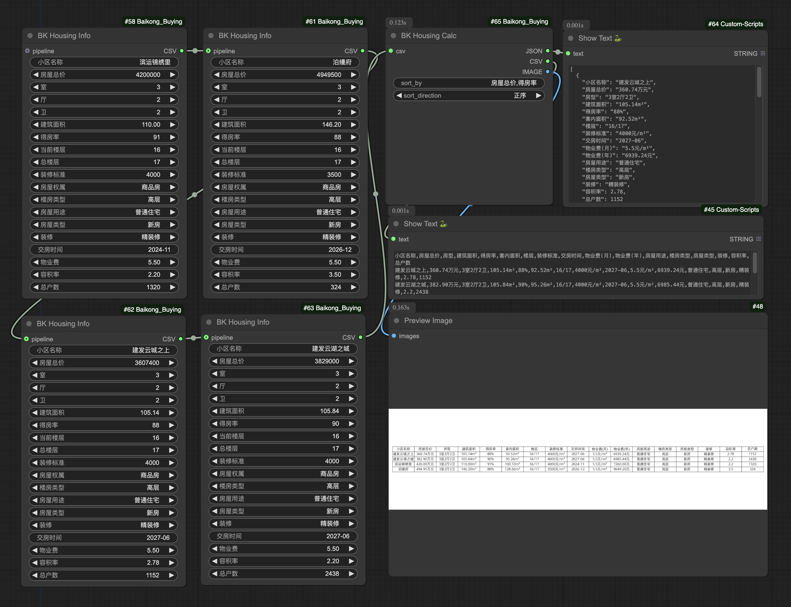

# ComfyUI Baikong Buying

## Home Buying Decision Factors 买房决策因子

By considering income, expenses, and their variations when buying a home, we can predict future returns on home purchases.

通过考虑买房时候的收入、支出和变化，对未来的买房收益进行预判。

| workflow | output |
| --- | --- |
|  |  |

汇总目标房产信息

